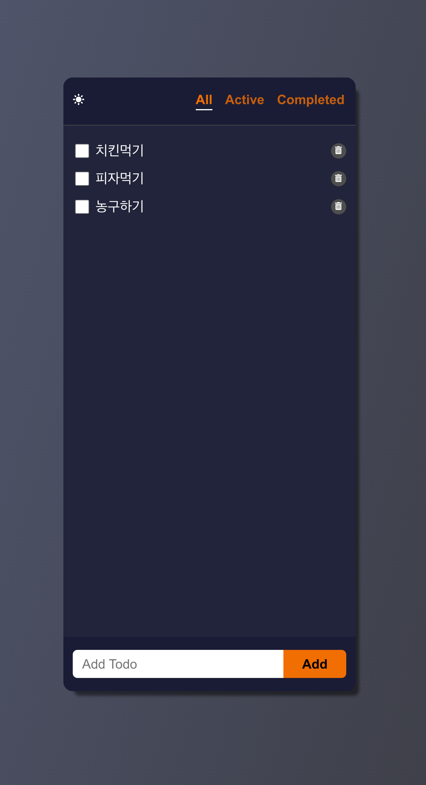

# 리액트 Todo (연습용)

네트워크 통신 없는 순수 리액트 및 css 로 할 일 웹 프론트 개발
* 다크모드 기능 구현
* 웹 스토리지(로컬 스토리지) 를 활용해 새로고침 혹은 페이지 재 진입 시 등록한 데이터 저장

## 개발환경

- MacOS
- VSCode
- Nodejs 16
- Chrome

## 기술스택

- React 18 (React Hooks)
- Yarn